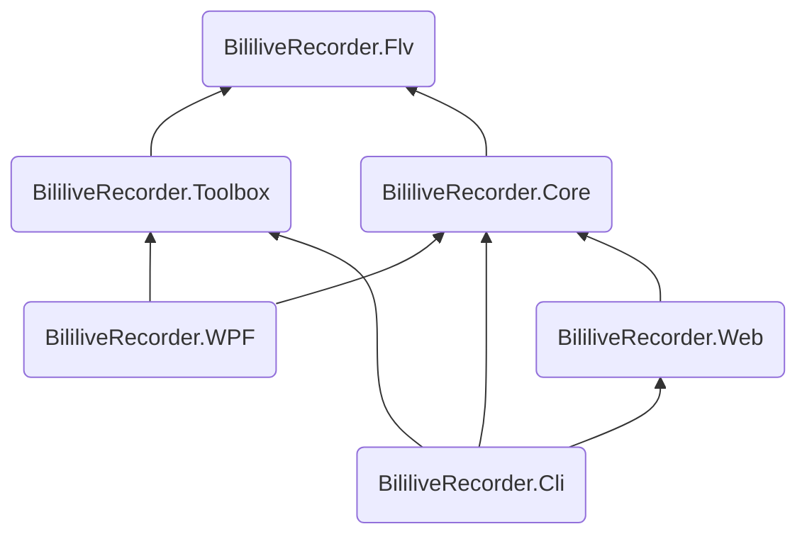

<div style="text-align:center">


# B站录播姬

[](https://github.com/BililiveRecorder/BililiveRecorder/actions/workflows/build.yml)
[](#)
[](#)
[](https://crowdin.com/project/bililiverecorder)

</div>

[简体中文 README | Simplified Chinese](README_CN.md)

GitHub is a global platform, and theoretically, everyone should use English. But since this project is mostly meant for Chinese user and rely on a Chinese website [BiliBili](https://live.bilibili.com) ([_wikipedia_](https://en.wikipedia.org/wiki/Bilibili)), most things related to this project like code comments, documentations and other related repositories are written in Chinese. This README file will always use English so people like _you_ can understand what is this, and perhaps make some use out of it.

Software UI is available in

- 简体中文 (Source and default)
- 繁体中文
- 日本語
- English

## Installation

See [rec.danmuji.org](https://rec.danmuji.org) (in Chinese) for Windows installer with auto update.

Alernatively, you can download from [releases](https://github.com/BililiveRecorder/BililiveRecorder/releases) page.  
The zip file available at the releases page does not have auto update enabled. You are welcome to watch this repository for new releases. (Click the "Watch" dropdown menu, then "Custom", and check the "Releases" checkbox).

Binary files of the command line version are available for Linux, macOS, and Windows at [releases](https://github.com/BililiveRecorder/BililiveRecorder/releases).

Docker images can be pulled from [Docker Hub `bililive/recorder`](https://hub.docker.com/r/bililive/recorder) or [`ghcr.io/bililiverecorder/bililiverecorder`](https://github.com/bililiverecorder/BililiveRecorder/pkgs/container/bililiverecorder).

See [rec.danmuji.org/user/install](https://rec.danmuji.org/user/install) for step by step installation guides (in Chinese).

## Feature

- Easy to use
- Start recording automatically when stream starts
- Record multiple stream at same time
- Fix broken recording caused by broken bilibili stream server
- Toolbox mode to fix broken bilibili stream recording recorded by other software<sup>1</sup>
- Pure C#, no native dependency like ffmpeg<sup>2</sup>
- Open source!

<sup>1</sup>: Only unprocessed flv file downloaded directly from stream servers can be fixed. If the file is downloaded or processed by FFmpeg it no longer can be fixed, FFmpeg will fvck up the already broken recording even further.  
<sup>2</sup>: A minimal version of FFmpeg is bundled with the desktop edition of BililiveRecorder for the remux feature in toolbox.

## Versioning

This project is following Semantic Versioning since version 2.0.0.

Please note this does not include the public .NET API of `BililiveRecorder.Flv`, or any project within this repository for that matter. They are considered as internal implementation thus could have breaking changes in any releases.

## Building from source

Note: full git history is required for version generation to work.

WPF version:

```powershell
cd BililiveRecorder.WPF
msbuild -t:restore
msbuild
```

Command line version:

```sh
# Build WebUI, optional
git submodule update --init --recursive
./webui/build.sh
# For building on Windows:
# ./webui/build.ps1

dotnet build BililiveRecorder.Cli
```

## Project structure

Project | Target |
:--- |:--- |
BililiveRecorder.Flv | .NET Standard 2.0 |
BililiveRecorder.Core | .NET Standard 2.0 |
BililiveRecorder.Toolbox | .NET Standard 2.0 |
BililiveRecorder.WPF | .NET Framework 4.7.2 |
BililiveRecorder.Web | .NET 6 |
BililiveRecorder.Cli | .NET 6 |



## Reference & Acknowledgements

- [Adobe Flash Video File Format Specification 10.1.2.01.pdf](https://www.adobe.com/content/dam/acom/en/devnet/flv/video_file_format_spec_v10_1.pdf)
- [coreyauger/flv-streamer-2-file](https://github.com/coreyauger/flv-streamer-2-file) Used as a reference in the early stages of development
- [zyzsdy/biliroku](https://github.com/zyzsdy/biliroku) - (probably) first BiliBili stream recording tool.
