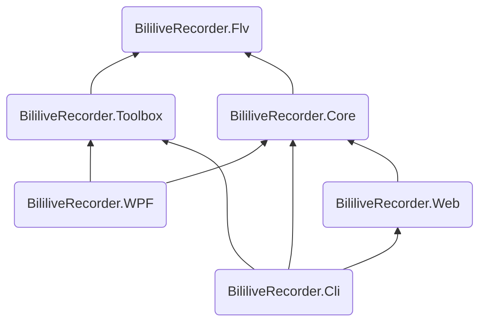

<div style="text-align:center">


# mikufans录播姬

[](https://github.com/BililiveRecorder/BililiveRecorder/actions/workflows/build.yml)
[](#)
[](#)
[](https://crowdin.com/project/bililiverecorder)

</div>

## 安装

在 [rec.danmuji.org](https://rec.danmuji.org) 提供了有自动更新功能的安装包。

或者也可以在 [releases](https://github.com/BililiveRecorder/BililiveRecorder/releases) 页面下载 “绿色版” 压缩包，没有版本检查和更新功能。你可以 watch 本仓库的新版本发布（点击 “Watch” 、点击 “Custom”、勾选 “Releases”）。

命令行版可执行文件可以在 [releases](https://github.com/BililiveRecorder/BililiveRecorder/releases) 页面下载，支持 Linux、 macOS 和 Windows 系统。

可以在 [Docker Hub `bililive/recorder`](https://hub.docker.com/r/bililive/recorder) 或 [`ghcr.io/bililiverecorder/bililiverecorder`](https://github.com/bililiverecorder/BililiveRecorder/pkgs/container/bililiverecorder) 拉取 Docker 镜像。

安装使用教程在 [rec.danmuji.org/user/install](https://rec.danmuji.org/user/install)。

## 功能

- 使用简单
- 主播开播后自动开始录制
- 同时录制多个直播间
- 自动修复mikufans直播服务器导致的各种问题
- 工具箱模式，用于修复旧版录播姬或其他软件录的视频文件<sup>1</sup>
- 纯 C# 实现，无 ffmpeg 等 native 依赖<sup>2</sup>
- 开源！

<sup>1</sup>：仅限未经处理的直接从直播服务器下载的原始FLV文件。 如果录播是用 FFmpeg 录制的或处理过的就无法修复了，FFmpeg 会进一步损坏有问题的文件。  
<sup>2</sup>：录播姬桌面版内含了一个 mini 版 FFmpeg 用于工具箱内的转封装功能。

## 版本号

本项目从 2.0.0 开始使用 Semantic Versioning。

请注意各个项目（比如 `BililiveRecorder.Flv`）的 .NET API 就算是 public 的也属于内部实现，所以不保证任何版本之间源代码接口的兼容性。

## 编译

注意：需要有完整的 git 历史才能生成版本号。

WPF 版：

```powershell
cd BililiveRecorder.WPF
msbuild -t:restore
msbuild
```

命令行版：

```sh
# Build WebUI, optional
git submodule update --init --recursive
./webui/build.sh
# For building on Windows:
# ./webui/build.ps1

dotnet build BililiveRecorder.Cli
```

## 项目结构

Project | Target |
:--- |:--- |
BililiveRecorder.Flv | .NET Standard 2.0 |
BililiveRecorder.Core | .NET Standard 2.0 |
BililiveRecorder.Toolbox | .NET Standard 2.0 |
BililiveRecorder.WPF | .NET Framework 4.7.2 |
BililiveRecorder.Web | .NET 6 |
BililiveRecorder.Cli | .NET 6 |



## 参考资料 & 鸣谢

- [Adobe Flash Video File Format Specification 10.1.2.01.pdf](https://www.adobe.com/content/dam/acom/en/devnet/flv/video_file_format_spec_v10_1.pdf)
- [coreyauger/flv-streamer-2-file](https://github.com/coreyauger/flv-streamer-2-file) 曾在本项目开发早期作为参考
- [zyzsdy/biliroku](https://github.com/zyzsdy/biliroku): (大概是)第一个mikufans直播录播工具
